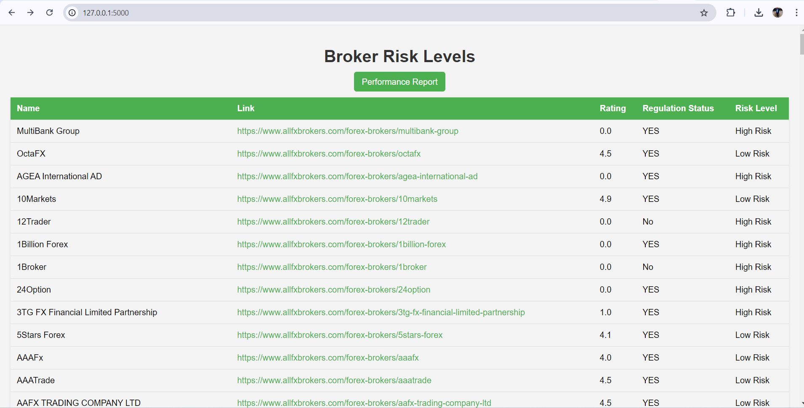
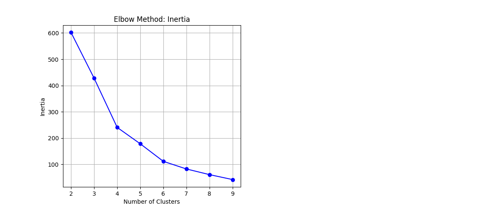
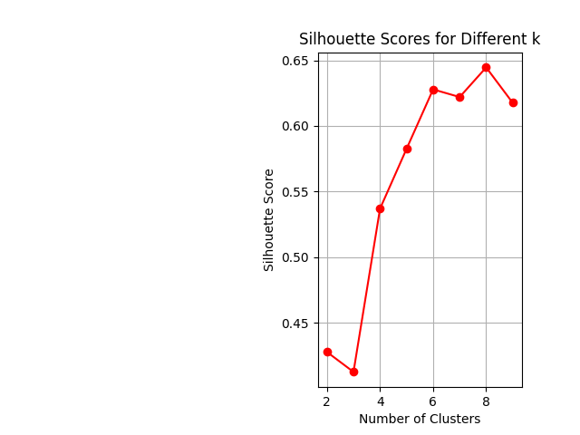

# 🎯 FX Trading Risk Detector

A machine learning project designed to assess and categorize the risk levels of forex trading platforms using K-means clustering.



## 📖 Table of Contents
- [Features](#features)
- [Getting Started](#getting-started)
- [Installation](#installation)
- [Usage](#usage)
- [Performance Metrics](#performance-metrics)
- [Contributing](#contributing)

## 🌟 Features
- Analyze forex brokers based on regulatory status and user ratings.
- Classify brokers into low and high-risk categories.
- Visualize performance metrics using inertia and silhouette scores.

## 🚀 Getting Started

### Prerequisites
Make sure you have the following installed:
- Python 3.x
- pip (Python package installer)

### Installation
1. Clone the repository:
    ```bash
    git clone https://github.com/<your-username>/FXTradingRiskDetector.git
    cd FXTradingRiskDetector
    ```

2. Create and activate a virtual environment:
    ```bash
    python -m venv .venv
    # Windows
    .venv\Scripts\activate
    # macOS / Linux
    source .venv/bin/activate
    ```

3. Install the required packages:
    ```bash
    pip install -r requirements.txt
    ```
## 📊 Performance Metrics

The performance of the K-means clustering model is evaluated using several important metrics, which help in understanding the effectiveness of the clustering approach.

### 1. Inertia
- **Definition**: Inertia is the sum of squared distances from each point to its assigned cluster centroid. It serves as a measure of how tightly the clusters are packed. Lower inertia values indicate that the clusters are well-defined and closely packed.
- **Value**: 601.4585531

### 2. Silhouette Score
- **Definition**: The silhouette score measures how similar an object is to its own cluster compared to other clusters. It ranges from -1 to +1, where a value close to +1 indicates that the objects are well matched to their own cluster and poorly matched to neighboring clusters. A higher silhouette score suggests better-defined clusters.
- **Value**: 0.427823354

### Visualization of Performance Metrics
To better understand these metrics, we provide visual representations:

#### Inertia Plot
This plot illustrates the inertia values for the K-means clustering model, showcasing how well the clusters are defined. Lower inertia values indicate tighter, more compact clusters.



#### Silhouette Plot
The silhouette plot offers insights into how similar the data points are to their respective clusters. A higher silhouette score indicates that the clusters are distinct and well-defined.



## 💻 Usage
Run the Flask application:
```bash
python app.py


